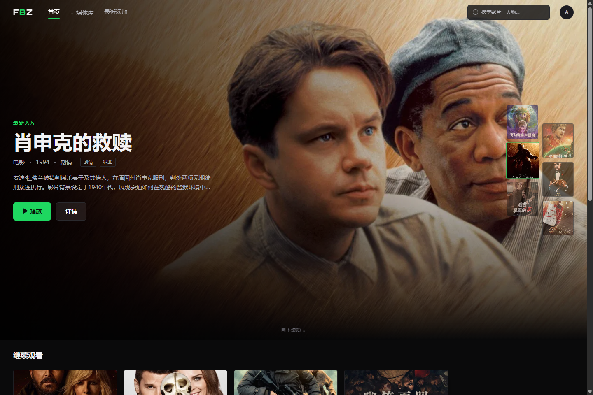
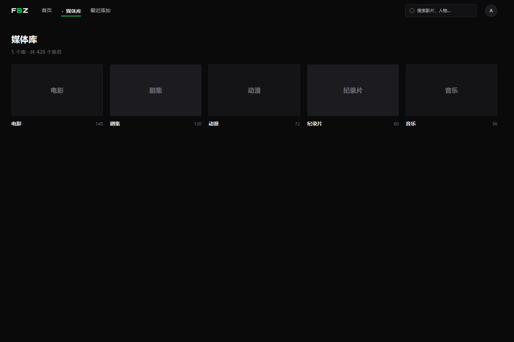
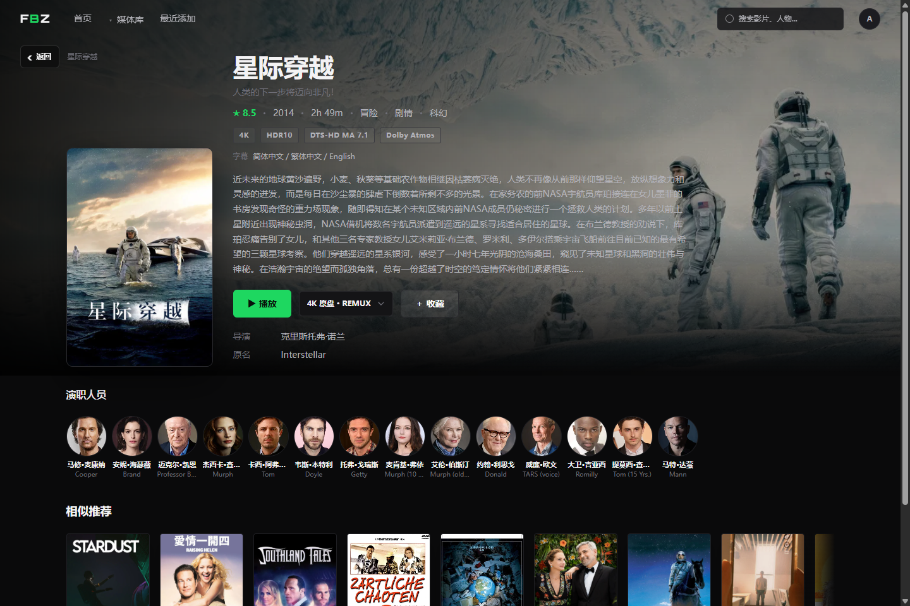
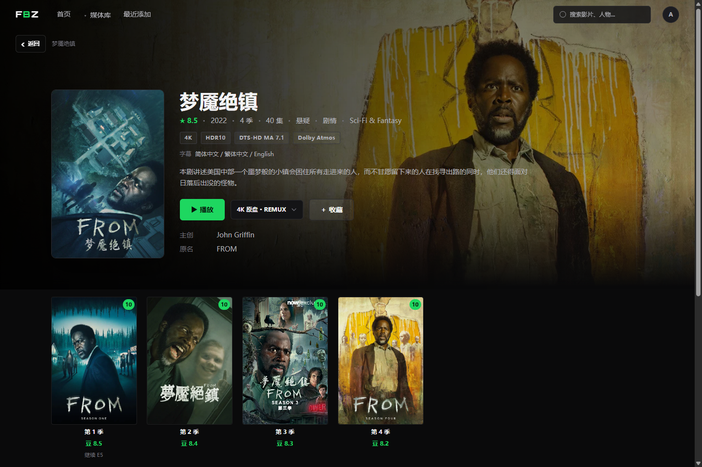
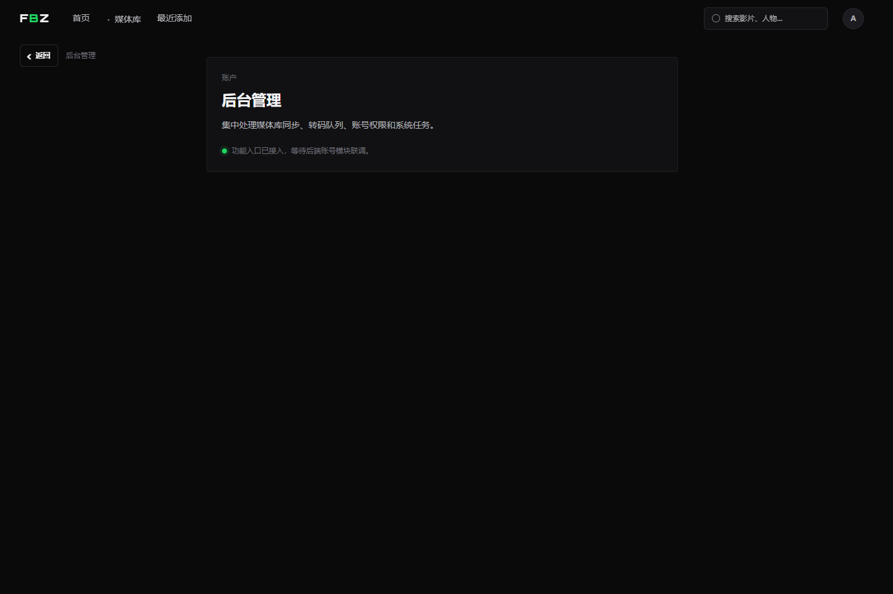

# FBZ

FBZ 是一个自托管媒体服务器项目，目标是提供 Emby 兼容后端和配套 Web 管理界面，用于管理、浏览和播放本地电影、剧集、音乐等媒体库。

项目目前以 vibe coding 方式快速推进，欢迎有能力和兴趣的人一起开发。

## 界面预览











## 功能方向

- 媒体库扫描与管理
- Emby REST API 兼容
- 用户、设备、权限和播放状态
- 本地播放、STRM 跳转、HLS 转码
- 元数据刷新、图片缓存、字幕处理
- 插件、通知、计划任务和事件 hook
- Web 前端媒体库与后台管理界面

## 架构

```text
fbz/
├─ fbz-api/   # Rust 后端
├─ fbz-fe/    # Vue 前端
├─ docs/      # 架构与计划文档
├─ demo/      # 早期 demo
└─ canvas/    # 设计探索资产
```

### 后端

`fbz-api` 是 Rust modular monolith，当前先保持单体部署，内部按 API、媒体库、扫描、元数据、转码、插件、通知、计划任务等模块拆分。

主要技术：

- Rust 2024
- axum / tokio / tower-http
- PostgreSQL / sqlx
- Redis / Redis Streams
- FFmpeg / ffprobe
- Wasmtime / WASI

### 前端

`fbz-fe` 是 Vue 3 + TypeScript 前端，定位为暗色、信息密集的媒体工作台和后台管理界面。

主要技术：

- Vue 3
- TypeScript
- Vite+
- Pinia
- Vue Router
- UnoCSS / SCSS
- Shaka Player

## 本地开发

后端：

```powershell
cd fbz-api
cargo run
```

前端：

```powershell
cd fbz-fe
pnpm install
pnpm dev
```

配置模板见 `fbz-api/.env.example`。本地 `.env` 不提交。

## License

MIT
